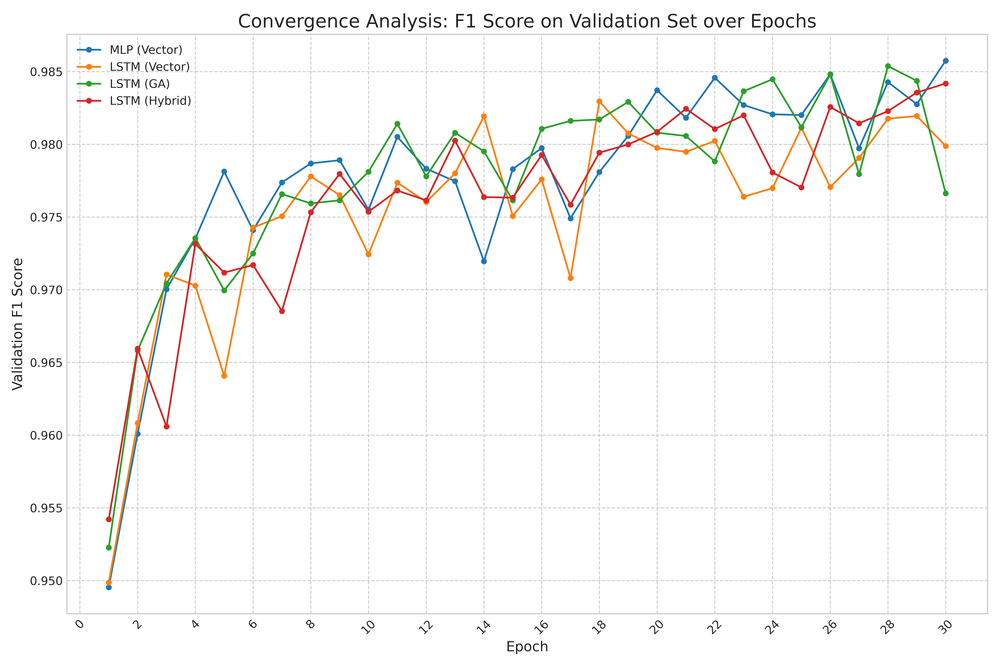

# Geometric-AI: Enhancing LEO Satellite Link Prediction with Deep Learning and Geometric Algebra Features

This repository contains the official source code and experimental data for the paper titled: **"Geometric-AI: Enhancing LEO Satellite Link Prediction with Deep Learning and Geometric Algebra Features"**.

Our research introduces a novel framework that leverages Geometric Algebra (GA) as a powerful feature engineering tool to improve the accuracy and robustness of deep learning models for predicting Inter-Satellite Link (ISL) availability in dynamic LEO satellite constellations.

[](link_to_your_paper_once_published)
[](https://opensource.org/licenses/MIT)

## Overview of the Framework

The core idea of our work is to investigate whether providing AI models with geometrically rich features can enhance their predictive capabilities. We systematically compare traditional kinematic vector representations with novel features derived from GA, such as the orbital plane bivector.

The project is structured around a comprehensive experimental pipeline:
1.  **Dynamic Simulation:** We built a simulator using `Skyfield` to generate high-fidelity datasets of satellite states (position, velocity) and ground-truth connectivity (Line-of-Sight) for three real-world constellations: Iridium, Starlink, and OneWeb.
2.  **Feature Engineering:** We implemented modules to generate three distinct feature sets: `Vector`, `GA`, and `Hybrid`.
3.  **AI Model Training & Evaluation:** We compared the performance of MLP and LSTM architectures on the link prediction task, culminating in a detailed analysis of convergence, ablation, and sensitivity.


*Fig: Convergence analysis of the evaluated models, demonstrating the learning process over 30 epochs.*

## Repository Structure

```
.
├── paper_figures/          # All figures generated for the paper
│   ├── fig_connectivity_over_time.png
│   ├── fig_tsne_feature_space.png
│   ├── fig_ablation_study.png
│   ├── fig_convergence_analysis.png
│   └── fig_sensitivity_analysis.png
├── *.tle                   # TLE files for constellations (e.g., iridium.tle)
├── utils.py                # Core utilities: AI models, data prep, training functions
├── simulator_v2.py         # Generates the simulation datasets (*.npz files)
├── paper_visualizer.py     # Generates Table 2 and Figure 2
├── benchmark_operations.py # Generates Table 1
├── generate_tsne_plot.py   # Generates the t-SNE visualization (Figure 3)
├── train_ablation_study.py # Runs the ablation study experiment (Figure 4)
├── train_convergence_analysis.py # Runs the main performance comparison (Table 3, Figure 5)
├── train_sensitivity_analysis.py # Runs the sensitivity analysis (Figure 6)
└── README.md
```

## Reproducing the Results

To reproduce the experiments, please follow these steps.

### 1. Installation

The project uses `conda` for environment management.

```bash
# Clone the repository
git clone https://github.com/ailabteam/sgin_ga.git
cd sgin_ga

# Create conda environment from the provided file (or manually)
# Note: You can create a requirements.txt or environment.yml file for easier setup.
# For now, install manually:
conda create -n sgin_ga python=3.10 -y
conda activate sgin_ga

# Install core packages
conda install pytorch torchvision torchaudio pytorch-cuda=12.1 -c pytorch -c nvidia -y
conda install -c conda-forge numpy pandas matplotlib scikit-learn skyfield clifford -y
```
*Note: The `clifford` library requires `numba`. Ensure you have a compatible version (`numba < 0.58.0` worked in our experiments).*

### 2. Data Generation

First, download the TLE files and then run the simulator to generate the datasets.

```bash
# Download TLE data
wget -O iridium.tle "https://celestrak.org/NORAD/elements/gp.php?GROUP=iridium&FORMAT=tle"
wget -O starlink.tle "https://celestrak.org/NORAD/elements/gp.php?GROUP=starlink&FORMAT=tle"
wget -O oneweb.tle "https://celestrak.org/NORAD/elements/gp.php?GROUP=oneweb&FORMAT=tle"

# Run the simulator for all three constellations (this may take a few minutes)
python simulator_v2.py --group iridium --max_sats 50
python simulator_v2.py --group starlink --max_sats 50
python simulator_v2.py --group oneweb --max_sats 50
```
This will create `sim_data_iridium.npz`, `sim_data_starlink.npz`, and `sim_data_oneweb.npz`.

### 3. Running Experiments

You can now run the individual analysis scripts to generate the tables and figures for the paper.

```bash
# Generate descriptive figures and tables (Table 2, Fig 2)
python paper_visualizer.py

# Generate the main results (Table 3, Fig 5)
# This is a long-running script.
python train_convergence_analysis.py

# Generate supplementary analyses (optional but recommended)
python benchmark_operations.py         # Table 1
python generate_tsne_plot.py         # Fig 3
python train_ablation_study.py       # Fig 4
python train_sensitivity_analysis.py # Fig 6
```

## Citation

If you find this work useful for your research, please consider citing our paper:

```bibtex
@article{Do_GeometricAI_XXXX,
  author    = {Do, Phuc Hao and Van, Nguyen Nang Hung and Pham, Minh Tuan},
  title     = {Geometric-AI: Enhancing LEO Satellite Link Prediction with Deep Learning and Geometric Algebra Features},
  journal   = {IEEE Transactions on Aerospace and Electronic Systems},
  year      = {XXXX},
  volume    = {XX},
  number    = {XX},
  pages     = {XXXX-XXXX},
  doi       = {XX.XXXX/TAES.XXXX.XXXXXXX}
}
```
*(Note: Please update the BibTeX entry with the correct publication details once available.)*

## License

This project is licensed under the MIT License - see the [LICENSE.md](LICENSE.md) file for details.
